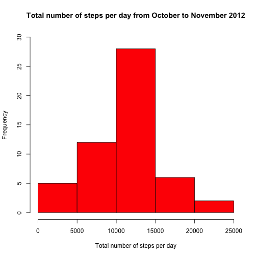
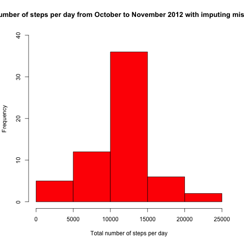

# Reproducible Research: Peer Assessment 1


## Loading and preprocessing the data

```r
# 1. Load the data.
setwd('/Users/shenzhenyuan/Desktop/MOOC/Coursera/JHU-Data Science/Reproducible Research/Course Projects/Course Project 1')
data<-read.csv('activity.csv')

# 2. Porcess/Transform the data.
data<-transform(data,interval = factor(interval))
```

## What is mean total number of steps taken per day?

```r
# 1. Make a histogram of the total number of steps taken each day.
total_steps<-tapply(data$steps,data$date,sum)
hist(total_steps,col = "red",main = "Total number of steps per day from October to November 2012",xlab = "Total number of steps per day",ylim = c(0,30))
```

 

```r
# 2. Calculate and report the mean and median total number of steps taken per day.
mean_steps<-mean(total_steps,na.rm = TRUE)
median_steps<-median(total_steps, na.rm = TRUE)
sprintf("The mean and median of the total steps taken per day are %.4f and %.4f, respectively.",mean_steps, median_steps)
```

```
## [1] "The mean and median of the total steps taken per day are 10766.1887 and 10765.0000, respectively."
```


## What is the average daily activity pattern?

```r
# 1. Make a time series plot of the 5-minute interval and averaged number of steps taken.
y<-tapply(data$steps,data$interval,mean,na.rm = TRUE)
plot(attr(data$interval,'levels'),y,type = 'l', main = "Average daily activity pattern", xlab = "5-minute interval", ylab = "averaged steps taken")
```

 

```r
# 2. Find the interval corresponds to the peak of the plot above. 
max_interval <- names(y[which(y==max(y))])
sprintf("The 5-minute interval which on average contains the maximum number of steps is %s.",max_interval)
```

```
## [1] "The 5-minute interval which on average contains the maximum number of steps is 835."
```


## Imputing missing values

```r
# 1. Calculate and report the total number of missing values in the dataset.
num_of_missing_days<-sum(apply(total_steps,1,is.na))  ## calculate # of days with missing data
num_of_missing_rows<-sum(apply(data,1,is.na))     ## calculate # of rows with missing data
sprintf("%d rows contain 'NA' in total.",num_of_missing_rows)
```

```
## [1] "2304 rows contain 'NA' in total."
```

```r
# 2. Fill in the missing values with the mean of the corresponding interval.
# 3. Create a new dataset ('data_new') with the missing data filled in.
data_new <- data
mean_of_interval<-tapply(data_new$steps,data_new$interval,mean,na.rm = TRUE)
for (i in 1:length(data_new$steps)){
    if(is.na(data_new$steps[i])){
        data_new$steps[i] = mean_of_interval[as.integer(data_new$interval[i])]
    }    
}

# 4. Make a histogram of the total number of steps taken each day
total_steps<-tapply(data_new$steps,data_new$date,sum)
hist(total_steps,col = "red",main = "Total number of steps per day from October to November 2012 with imputing missing values",xlab = "Total number of steps per day",ylim = c(0,40))
```

 

```r
# Calculate and report the mean and median total number of steps taken per day.
mean_steps_new<-mean(total_steps,na.rm = TRUE)
median_steps_new<-median(total_steps, na.rm = TRUE)
sprintf("The mean and median of the total steps taken per day are %.4f and %.4f, respectively.",mean_steps_new, median_steps_new)
```

```
## [1] "The mean and median of the total steps taken per day are 10766.1887 and 10766.1887, respectively."
```

```r
# Estimate the change of mean and median after imputing missing values.
delta_mean = mean_steps_new - mean_steps
delta_median = median_steps_new - median_steps
print(data.frame("delta_mean"=delta_mean,"delta_median"=delta_median))
```

```
##   delta_mean delta_median
## 1          0        1.189
```
To conclude, imputing missing data with the above strategy has no impact on the estimate of the mean number of the total steps, but increases the median number by replacing the NA values with averaged values of corresponding intervals.

## Are there differences in activity patterns between weekdays and weekends?

```r
# 1. Create a new factor vairable indicating whether a given date is a weekday or weekend day.
date<-weekdays(as.Date(data_new$date))
group = factor(date =="Sunday"|date == "Saturday",label = c('weekday','weekend'))
data_new = cbind(data_new,group)

# 2. Make a panel plot of the 5-minute interval and the averaged number of steps taken for both weekday and weekend.

y <- tapply(data_new$steps,list(data_new$interval,data_new$group),mean)

par(mfrow = c(2,1))
plot(attr(data_new$interval,'levels'),y[,'weekday'],type = 'l',ylab = "Number of steps", xlab = "Interval",main = 'weekday')
plot(attr(data_new$interval,'levels'),y[,'weekend'],type = 'l',ylab = "Number of steps", xlab = "Interval",main = 'weekend')
```

 
